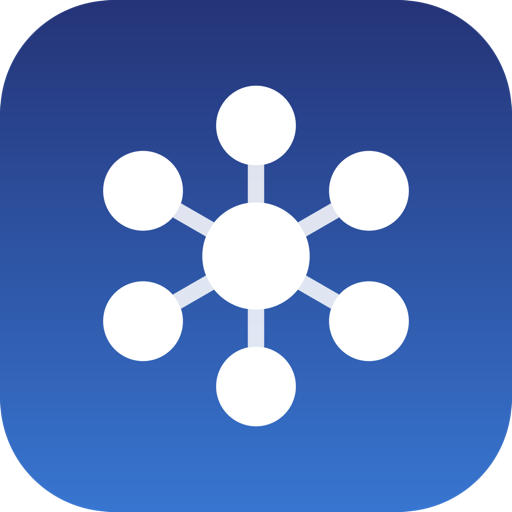
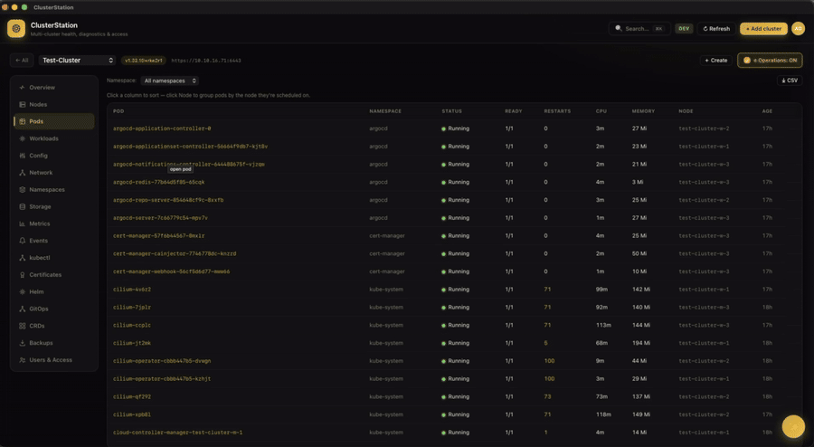

<div align="center">



# ClusterStation

### One station. Many clusters.

A unified control plane for a fleet of Kubernetes clusters — on **macOS**, **Windows** and **Linux**.

Bring your own kubeconfig. Nothing runs in the cloud. Everything is **read-only** until you say otherwise.


[](../../releases/latest)
[](LICENSE)
[](../../releases/latest)
[](../../releases/latest)
[](../../releases/latest)


</div>

---

**ClusterStation** is a single, self-contained desktop app that shows your **whole Kubernetes fleet** — dozens of clusters — as one command center. It grades every cluster's health, surfaces what's broken, and takes you from *"which cluster is unhappy?"* to *"why is this pod crash-looping?"* in a couple of clicks. Logs, diagnostics, a read-only kubectl terminal, Helm, GitOps and a local AI assistant are all built in.

It runs a local server behind a native window, talks only to `127.0.0.1`, stores your clusters **encrypted on disk**, and acts with **exactly** the RBAC of the kubeconfig you give it. No cloud, no accounts server, no telemetry.

## Contents

- [Why ClusterStation](#why-clusterstation)
- [Download & install](#download--install)
- [Screenshots](#screenshots)
- [What you can do](#what-you-can-do)
- [Operations mode](#operations-mode-making-changes)
- [Local AI assistant](#local-ai-assistant-optional)
- [Security](#security)
- [Configuration](#configuration-optional)
- [Where it keeps things](#where-it-keeps-things)
- [Build from source](#build-from-source)
- [Uninstall](#uninstall)
- [Requirements & limitations](#requirements--limitations)
- [License](#license)

## Why ClusterStation

Most Kubernetes dashboards show you **one** cluster at a time and assume you're the admin of it. Real operators run **many** clusters — prod/staging/edge, per-region, per-customer — and need to know, at a glance, which ones need attention and why.

- **Fleet-first.** A Mission-Control board grades and groups every cluster; drill into any one without switching contexts or juggling kubeconfigs.
- **Diagnose, don't just display.** Built-in explanations for CrashLoopBackOff, OOMKilled, ImagePullBackOff, pending scheduling, probe failures and node pressure.
- **Safe by default.** Read-only until you explicitly enable Operations mode per cluster; every change is confirmed and audited.
- **Yours, locally.** Your own login, encrypted storage, no cloud dependency, no telemetry. Works with a full-admin kubeconfig or a narrowly namespace-scoped one.

## Download & install

Grab the build for your OS from the **[latest release](../../releases/latest)**. On first launch you **create your own account** (username + password) — then **+ Add cluster** and upload or paste a kubeconfig.

### 🍎 macOS (universal — Apple Silicon & Intel)

1. Download **`ClusterStation-<version>.dmg`**, open it, and drag **ClusterStation** into **Applications**.
2. The app is ad-hoc signed (not notarized), so clear the quarantine flag once:

   ```sh
   xattr -dr com.apple.quarantine "/Applications/ClusterStation.app"
   ```

   > If macOS still says *"ClusterStation can't be opened"*, right-click the app → **Open** → **Open**.

3. Launch it.

### 🪟 Windows 10 / 11 (amd64)

1. Download **`ClusterStation.exe`** — one self-contained file (the server is bundled inside).
2. Run it. It's unsigned, so SmartScreen may warn → **More info → Run anyway** (one time).

It opens a **native window** via the **WebView2 runtime** (built into Windows 11 and current Windows 10). If WebView2 is ever missing it falls back to your default browser — install the *Microsoft Edge WebView2 Runtime* for the native window.

### 🐧 Debian / Ubuntu (and derivatives, amd64 or arm64)

```sh
sudo apt install ./clusterstation_<version>_<arch>.deb    # apt pulls the WebKitGTK deps
# …or:  sudo dpkg -i clusterstation_*.deb && sudo apt-get -f install
```

Launch **ClusterStation** from your applications menu or run `clusterstation`. It opens a **true native GTK/WebKit window**. Needs **WebKitGTK 4.1** (`libwebkit2gtk-4.1-0`), present on Debian 12+, Ubuntu 22.04+ and derivatives — `apt` installs it for you.

## Screenshots
| Fleet board |
|:---:|
|  |

| Pod details |
|:---:|
|  |

| kubectl terminal | AI assistant |
|:---:|:---:|
|  |  |


## What you can do

### 🛰️ See the whole fleet at a glance
A **Mission-Control board** of health tiles, grouped the way you organize them, each graded 🟢 healthy / 🟡 warning / 🔴 critical with a pulsing dot so trouble stands out. A slim fleet-pulse header sums it up — clusters, health counts, nodes, pods. Prefer a dense list? One click, remembered.

### 🔍 Drill into any cluster
Tabs for **Nodes, Pods, Workloads, Config, Network, Namespaces, Storage, Metrics, Events, Certificates, Helm, GitOps, CRDs** and **Users & Access** — with sticky headers, click-to-sort, and click-any-row to open a resizable detail slide-over (YAML + Events).

### 🩺 Understand what's wrong
**Diagnose** any pod or node for likely cause + evidence + suggested fixes (CrashLoopBackOff, OOMKilled, ImagePullBackOff, pending/scheduling, probe failures, node pressure…). Open a pod for a full view: IPs, node, QoS, owner, per-container image / state / **last exit code** / resources / probes, plus **live logs, events and port-forward** on one screen.

### 📜 Follow logs live
Stream logs with search, regex, time-range, previous-container, multi-container and download. Tail 200 / 5,000 / everything — even very chatty pods stream smoothly.

### 💻 Run read-only kubectl — in-app
A real terminal for the selected cluster: `get / describe / logs / top / events / explain / auth can-i`, with **Tab completion** and history. Mutating verbs (delete/apply/edit/scale/exec…) are **blocked**. Needs `kubectl` on your `PATH`.

### ✨ Ask a local AI
A floating chat that reads the **current screen's errors** and helps you fix them — powered by a model **you** run with [Ollama](https://ollama.com). No cloud, no API key, nothing leaves your machine.

### 🚀 GitOps & Helm
Auto-detects **Argo CD** and lists Applications with sync/health, revision, source and a detail view (inspect-only). Reads **Helm** releases, history, values and rendered manifests — and, in Operations mode, **installs / upgrades / rolls back / uninstalls** them (with a dry run).

### 🔎 Search & compare
**⌘K / Ctrl+K** searches pods, deployments, services, nodes and more across *every* cluster at once. **Compare** puts 2–8 clusters side by side and calls out version / CNI / ingress / runtime / OS / StorageClass drift.

### 🔐 Users & Access
Create ServiceAccount or client-certificate users, grant RBAC with presets across **one or more namespaces at once**, download the generated kubeconfig, and run `can-i` / effective-rules checks. Works even when your own kubeconfig is **namespace-scoped** — tell ClusterStation which namespaces it can reach (per-cluster **Limit to namespaces**) and it queries only those.

## Operations mode (making changes)

ClusterStation is **read-only by default**. Every action that changes a cluster — restart, scale, delete pod, cordon, exec, apply/edit/create YAML, Helm write — lives behind a per-cluster **Operations toggle** that is **off by default** and **resets to off on restart**. Turning it on for a cluster marked *production* asks for an extra confirmation, edits & creates offer a server-side **dry run**, and every write is recorded in the audit log.

## Local AI assistant (optional)

Install [Ollama](https://ollama.com) (macOS: `brew install ollama`; Windows/Linux: see the site), then pull a model:

```sh
ollama pull qwen2.5-coder:7b     # or :14b for more depth if you have the RAM
```

In the app: **avatar menu → ✨ AI assistant**, set the model name, Test, Save. The floating ✨ button then appears on every screen. Answers are a helpful first read — always sanity-check a suggested command before running it on production.

## Security

- **Local only** — binds to `127.0.0.1`; nothing outside your machine can reach it.
- **Least privilege** — acts with exactly your kubeconfig's RBAC; grants no extra access.
- **Read-only by default** — writes are opt-in per cluster, production-confirmed, and audited.
- **Your own account** — created on first launch and stored **salted-hashed** inside the encrypted data dir; never in clear, never in the cloud. Change it under the avatar menu → **Account**.
- **Encrypted at rest** — the cluster registry and login accounts are AES-256-GCM encrypted (see [Where it keeps things](#where-it-keeps-things)).
- **No telemetry, no accounts server.**

> **Certificate users:** client-cert kubeconfigs can't be re-downloaded — the private key is shown once and never stored. Save it when you create it.
>
> **Backups:** a `.csbackup` file contains live kubeconfigs in plain JSON — treat it like a password.

### Forgot your password?

ClusterStation runs entirely offline, so there's no email reset — recovery is local. Add a temporary login to your `fleet.env` (see paths below) and restart:

```ini
FLEET_USERS=recover:some-temp-password
```

Sign in as `recover`, set a fresh password under **avatar menu → Account**, then remove the `FLEET_USERS` line.

## Configuration (optional)

Set these in `fleet.env` (see [Where it keeps things](#where-it-keeps-things)) or as environment variables, then restart the app.

| Variable | Default | Purpose |
|---|---|---|
| `FLEET_ADDR` | `127.0.0.1:8443` | listen address |
| `FLEET_TLS_SELF_SIGNED` | `true` | serve HTTPS with an in-memory self-signed cert (macOS build) |
| `FLEET_DATA_DIR` | per-OS (see below) | encrypted registry + accounts location |
| `FLEET_AUDIT_FILE` | per-OS (see below) | durable audit log |
| `FLEET_AI_URL` | `http://localhost:11434` | local AI model server (Ollama) |
| `FLEET_AI_MODEL` | — | model name, e.g. `qwen2.5-coder:7b` (also settable in-app) |
| `FLEET_USERS` | — | optional recovery login(s) `user:pass,user2:pass2` — see *Forgot your password?* |

## Where it keeps things

Everything lives under your user profile — nothing is written system-wide.

| | macOS | Windows | Linux (`.deb`) |
|---|---|---|---|
| **Config / `fleet.env`** | `~/.config/clusterstation/` | `%LOCALAPPDATA%\ClusterStation\` | `~/.config/clusterstation/` |
| **Encrypted data** (clusters, accounts, AI config) | `~/Library/Application Support/ClusterStation/` | `%LOCALAPPDATA%\ClusterStation\data\` | `~/.local/share/clusterstation/` |
| **Logs / audit trail** | `~/Library/Logs/ClusterStation/` | `%LOCALAPPDATA%\ClusterStation\data\` | `~/.local/share/clusterstation/` |


## Uninstall

**macOS** — quit the app, then:

```sh
rm -rf "/Applications/ClusterStation.app" \
       ~/Library/Application\ Support/ClusterStation \
       ~/Library/Logs/ClusterStation \
       ~/.config/clusterstation
```

**Windows** — close the app, delete `ClusterStation.exe`, then remove `%LOCALAPPDATA%\ClusterStation` (holds your data & the extracted server).

**Linux** — `sudo apt remove clusterstation`, then `rm -rf ~/.config/clusterstation ~/.local/share/clusterstation` to drop your data.

## Requirements & limitations

- **macOS** 13 (Ventura)+ (Apple Silicon or Intel), **Windows** 10/11 (amd64, WebView2 runtime), **or** a **Debian/Ubuntu**-based Linux (amd64 or arm64).
- One or more kubeconfig files for the clusters you want to manage.
- *(Optional)* `kubectl` for the console, `helm` for Helm install/upgrade/rollback/uninstall, and [Ollama](https://ollama.com) for the AI assistant.
- The apps are unsigned/ad-hoc-signed: macOS needs the one-time `xattr` step; Windows and Linux show a one-time "unknown publisher" prompt.
- The Intel (x86_64) macOS slice and the Windows build are verified as builds but have had less real-world testing than Apple Silicon macOS.
- Argo CD is **inspect-only**; Helm write actions require the `helm` binary and Operations mode; the kubectl console requires `kubectl` on your `PATH`.

## License

Apache License 2.0 — see [LICENSE](LICENSE).

Copyright © 2026 ClusterStation.
