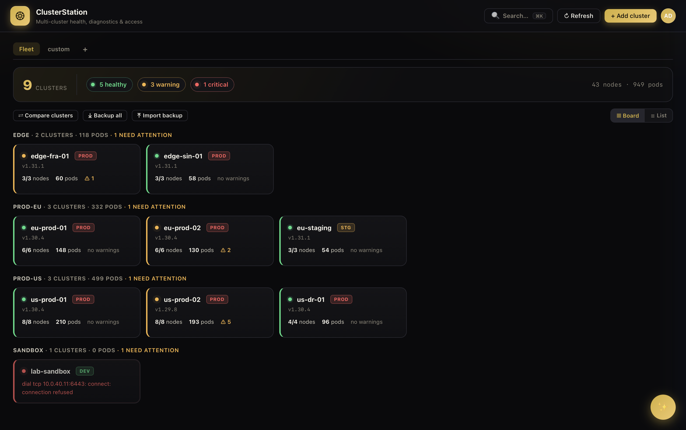
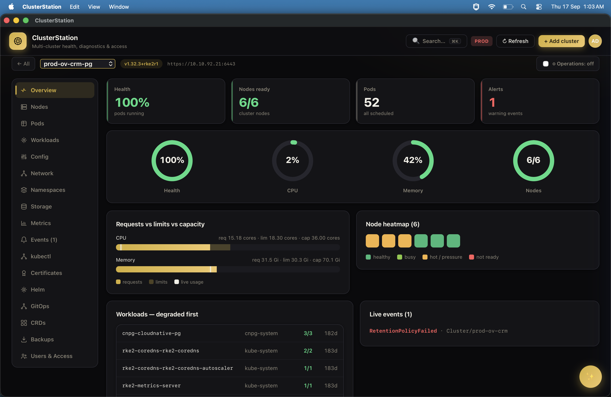
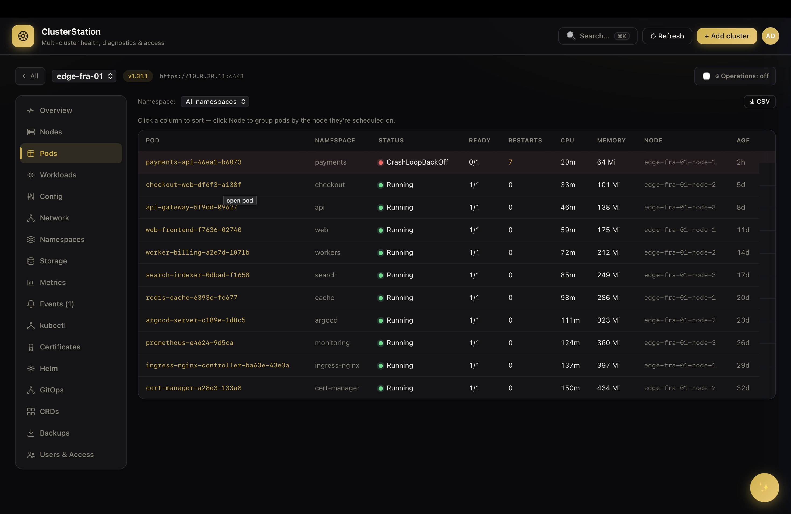
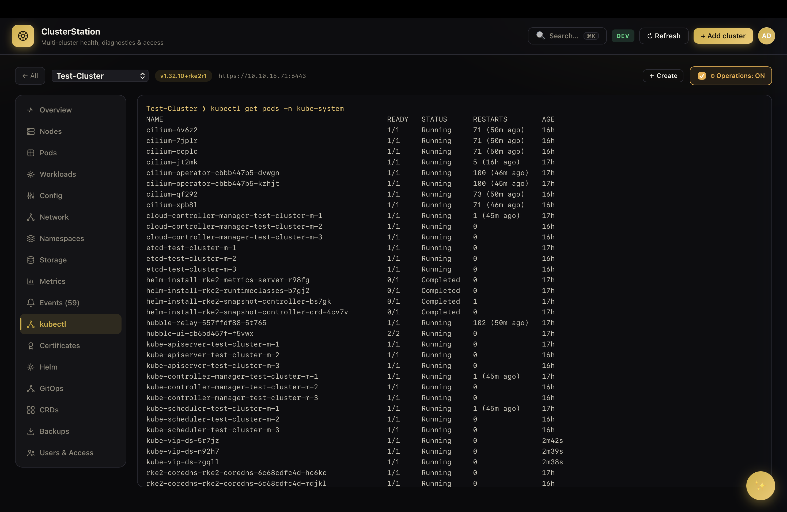
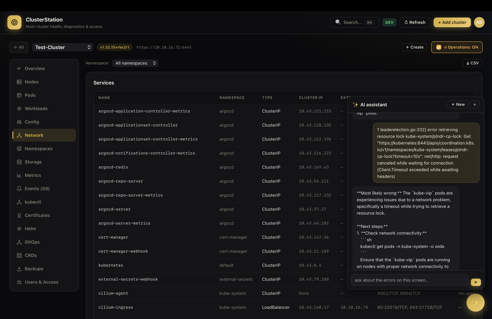

<div align="center">

# ⎈ ClusterStation

### A single dashboard for operating a fleet of Kubernetes clusters.

Bring your own kubeconfig. Nothing runs in the cloud. Everything is **read-only** until you say otherwise.

[](../../releases/latest)

[](../../releases/latest)
[](LICENSE)
[](../../releases/latest)


</div>

---

## What is it?

Most Kubernetes dashboards show you **one** cluster at a time. ClusterStation shows you a **fleet** — dozens of clusters as a single command center. It grades every cluster's health, surfaces what's broken, and lets you go from *"which of my clusters is unhappy?"* to *"why is this pod crash-looping?"* in a couple of clicks — logs, diagnostics, a kubectl terminal, and an AI assistant all built in.

It's a **native macOS app**: double-click to launch, it runs its own local server, and quits cleanly. It talks only to `127.0.0.1`, stores your clusters **encrypted on disk**, and acts with **exactly** the RBAC of the kubeconfig you give it. No cloud, no accounts, no telemetry.

## ⬇️ Download & install

1. **[Download the latest DMG →](../../releases/latest)** (macOS 13+, Apple Silicon & Intel — one universal build).
2. Open the DMG and drag **ClusterStation** into **Applications**.
3. The app is signed ad-hoc (not notarized), so macOS quarantines it. Clear that once in Terminal:

   ```sh
   xattr -dr com.apple.quarantine "/Applications/ClusterStation.app"
   ```

   > If macOS still says *"ClusterStation can't be opened"*, right-click the app → **Open** → **Open**.

4. Launch it, click **+ Add cluster**, and upload (or paste) a kubeconfig. That's it.

No Go, no Xcode, no admin password, no command line to keep it running.

## Screenshots

| Fleet board | Cluster Overview | Pod detail |
|:---:|:---:|:---:|
|  |  |  |

| kubectl terminal | AI assistant |
|:---:|:---:|
|  |  |

## What you can do

### 🛰️ See the whole fleet at a glance
A **Mission-Control board** of health tiles, grouped the way you organize them, each graded 🟢 healthy / 🟡 warning / 🔴 critical with a pulsing dot so trouble stands out. A slim fleet-pulse header sums it all up — clusters, health counts, nodes, pods. Prefer a dense list? One click, remembered.

### 🔍 Drill into any cluster
Tabs for **Nodes, Pods, Workloads, Config, Network, Namespaces, Storage, Metrics, Events, Certificates, Helm, GitOps, CRDs**, and **Users & Access** — with sticky headers and click-to-sort.

### 🩺 Understand what's wrong
**Diagnose** any pod or node for likely cause + evidence + suggested fixes (CrashLoopBackOff, OOMKilled, ImagePullBackOff, pending/scheduling, probe failures, node pressure…). Open a pod for a full detail view: IPs, node, QoS, owner, per-container image / state / **last exit code** / resources / probes, plus **live logs, events, and port-forward** on one screen.

### 📜 Follow logs live
Stream logs with search, regex, time-range, previous-container, multi-container, and download.

### 💻 Run read-only kubectl — in-app
A real terminal for the selected cluster: `get / describe / logs / top / events / explain / auth can-i`, with **Tab completion** and history. Mutating verbs (delete/apply/edit/scale/exec…) are **blocked**. Needs `kubectl` on your `PATH`.

### ✨ Ask a local AI
A floating chat that reads the **current screen's errors** and helps you fix them — powered by a model **you** run with [Ollama](https://ollama.com). No cloud, no API key, nothing leaves your Mac.

### 🚀 GitOps & Helm (read-only)
Auto-detects **Argo CD** and lists Applications with sync/health, revision, source and a detail view; reads **Helm** releases, history, values and rendered manifests.

### 🔎 Search & compare
**⌘K** searches pods, deployments, services, nodes and more across *every* cluster at once. **Compare** puts 2–8 clusters side by side and calls out version / CNI / ingress / runtime / OS / StorageClass drift.

### 🔐 Users & Access
Create ServiceAccount or client-certificate users, grant RBAC with presets, download the generated kubeconfig, and run `can-i` / effective-rules checks.

## Operations mode (making changes)

ClusterStation is **read-only by default**. Every action that changes a cluster — restart, scale, delete pod, cordon, exec, apply/edit/create YAML — lives behind a per-cluster **Operations toggle** that is **off by default** and **resets to off on restart**. Turning it on for a cluster marked *production* asks for an extra confirmation, edits & creates offer a server-side **dry run**, and every write is recorded in the audit log.

## Local AI assistant (optional)

```sh
brew install ollama
brew services start ollama
ollama pull qwen2.5-coder:7b     # or :14b for more depth if you have the RAM
```

Then in the app: **avatar menu → ✨ AI assistant**, set the model name, Test, Save. The floating ✨ button then appears on every screen. Answers are a helpful first read — always sanity-check a suggested command before running it on production.

## Security

- **Local only** — binds to `127.0.0.1`; nothing outside your Mac can reach it.
- **Least privilege** — acts with exactly your kubeconfig's RBAC; grants no extra access.
- **Read-only by default** — writes are opt-in per cluster, production-confirmed, and audited.
- **Encrypted at rest** — your cluster registry is AES-256-GCM encrypted under `~/Library/Application Support/ClusterStation`.
- **No accounts, no telemetry.** A random password is generated on first run (**App menu → Show Credentials**). Audit log: `~/Library/Logs/ClusterStation/audit.jsonl`.

> **Certificate users:** client-cert kubeconfigs can't be re-downloaded — the private key is shown once and never stored. Save it when you create it.
>
> **Backups:** a `.csbackup` file contains a live kubeconfig in plain JSON — treat it like a password.

## Configuration (optional)

Edit `~/.config/clusterstation/fleet.env` and restart the app.

| Variable | Default | Purpose |
|---|---|---|
| `FLEET_ADDR` | `127.0.0.1:8443` | listen address |
| `FLEET_TLS_SELF_SIGNED` | `true` | serve HTTPS with an in-memory self-signed cert |
| `FLEET_DATA_DIR` | `~/Library/Application Support/ClusterStation` | encrypted registry location |
| `FLEET_AUDIT_FILE` | `~/Library/Logs/ClusterStation/audit.jsonl` | durable audit log |
| `FLEET_AI_URL` | `http://localhost:11434` | local AI model server (Ollama) |
| `FLEET_AI_MODEL` | — | model name, e.g. `qwen2.5-coder:7b` (also settable in-app) |

## Where it keeps things

| Path | What |
|---|---|
| `~/.config/clusterstation/fleet.env` | config and generated password |
| `~/Library/Application Support/ClusterStation/` | encrypted cluster registry, user ledger, AI config |
| `~/Library/Logs/ClusterStation/` | server log and audit trail |

Nothing is written outside your home directory.

## Uninstall

```sh
# quit the app first, then:
rm -rf "/Applications/ClusterStation.app"
rm -rf ~/Library/Application\ Support/ClusterStation
rm -rf ~/Library/Logs/ClusterStation
rm -rf ~/.config/clusterstation
```

## Known limitations

- **macOS 13+ only.** The app is ad-hoc signed (not notarized), so the one-time `xattr` step above is required.
- The Intel (x86_64) slice is built and verified, but has had less testing than Apple Silicon.
- Helm and Argo CD views are **inspect-only** — install/upgrade/rollback and sync are left to your existing tooling.
- The read-only kubectl console requires `kubectl` installed on your machine.

## Requirements

- macOS 13 (Ventura) or newer — Apple Silicon or Intel.
- One or more kubeconfig files for the clusters you want to manage.
- *(Optional)* `kubectl` for the console; [Ollama](https://ollama.com) for the AI assistant.

## License

Apache License 2.0 — see [LICENSE](LICENSE).

Copyright © 2026 ClusterStation. All rights reserved.
